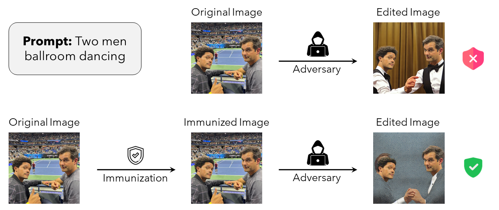
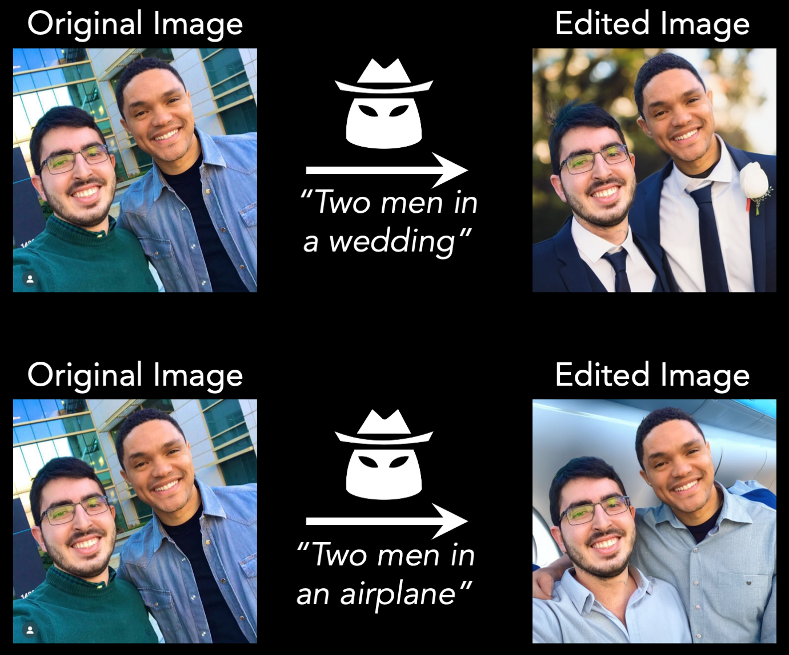
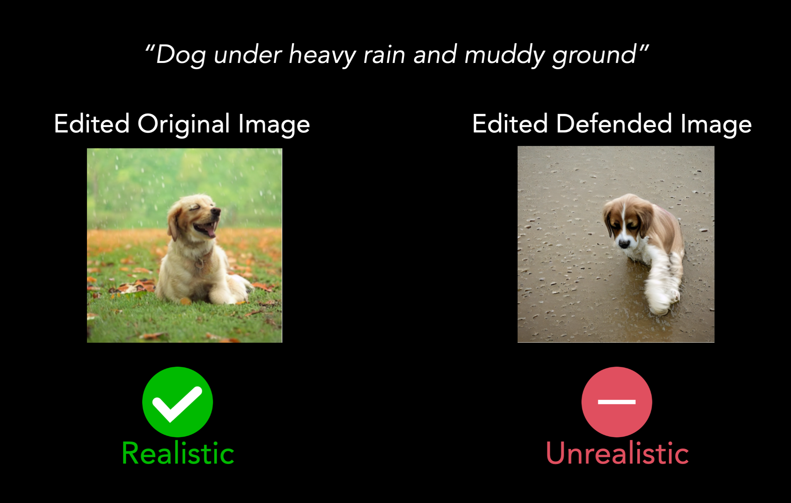
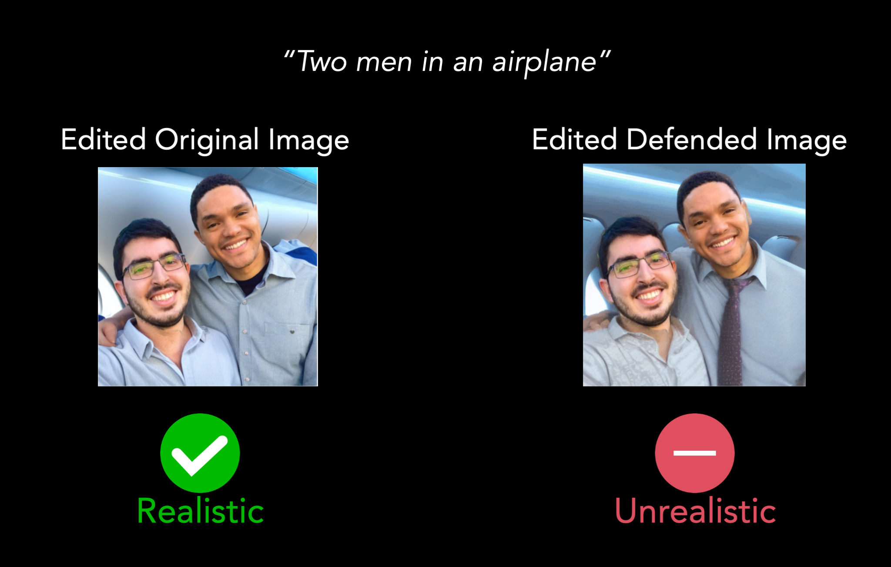
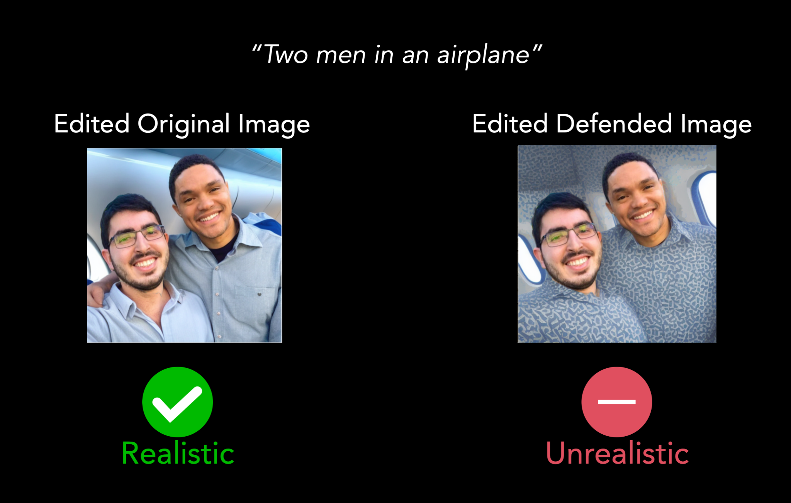

# Raising the Cost of Malicious AI-Powered Image Editing


This repository contains the code for our recent work on safe-guarding images against manipulation by ML-powerd photo-editing models such as [stable diffusion](https://stability.ai/blog/stable-diffusion-public-release).

**Raising the Cost of Malicious AI-Powered Image Editing** <br>
*Hadi Salman\*, Alaa Khaddaj\*, Guillaume Leclerc\*, Andrew Ilyas, Aleksander Madry* <br>
**Paper:** https://arxiv.org/abs/2302.06588 <br>
**Blog post:** https://gradientscience.org/photoguard/  <br>
**Interactive demo:** Coming soon!  <br>

```bibtex
    @article{salman2023raising,
      title={Raising the Cost of Malicious AI-Powered Image Editing},
      author={Salman, Hadi and Khaddaj, Alaa and Leclerc, Guillaume and Ilyas, Andrew and Madry, Aleksander},
      journal={arXiv preprint arXiv:2302.06588},
      year={2023}
    }
```

<p>
<kbd>

</kbd>
</p>

## Getting started
Our code relies on the [stable diffusion code on Hugging Face](https://github.com/huggingface/diffusers). 

1.  Clone our repo: `git clone https://github.com/madrylab/photoguard.git`

2.  Install dependencies:
    ```
      conda create -n photoguard python=3.10
      conda activate photoguard
      pip install --upgrade diffusers transformers scipy
      huggingface-cli login
    ```

3. You should now be all set! Check out our notebooks!


## Generating high-quality fake images
The first step is we will walk you through how you can generate high quality fake images. Check out this notebook! The result will be such images:

See [this notebook](notebooks/generating_fake_images.ipynb)!
[](https://colab.research.google.com/drive/1pwfeSe6MUjD7UfqdWxurMSWWZhic9TPl?usp=sharing)

<p>

</p>


## Simple photo-guarding (Encoder Attack):
Now, we describe the simplest form of photo safeguarding that we implement. In particular, we implement a simple PGD attack on the image embedding part of the stable diffusion model. We have two demos demonstrating the efficacy of such photo safeguarding method. The goal of both is to cause the stable diffusion model to generate something that is either unrealistic, or unrelated to the original image.

### Photo-guarding against Image-to-Image pipelines
The first is the case where someone uses an image + prompt to modify the input image based on the prompt description.

See [this notebook](notebooks/demo_simple_attack_img2img.ipynb)!
[](https://colab.research.google.com/drive/1P9_Xkbb05d5ynuvucFO6TjXJoXLq_Vyg?usp=sharing)

<p>

</p>


### Photo-guarding against Inpainting pipelines
The second is the more interesting scenario where someone wants to edit parts of an existing image via inpainting. The generated images after immunization are clearly fake!

See [this notebook](notebooks/demo_simple_attack_inpainting.ipynb)!
[](https://colab.research.google.com/drive/1q-p8_PWROVOAl6B07znev0W-Z9gKgoW2?usp=sharing)

<p>

</p>


## Complex photo-guarding (Diffusion attack)
For more effective photo-guarding especially against image inpainting, we need to attack the stable diffusion model end-to-end. Now, the generated images after immunization are even more clearly fake than above!

See [this notebook](notebooks/demo_complex_attack_inpainting.ipynb)!

<p>

</p>


That's it! Please let us know if you have any questions. And check our paper for details about each of these attacks.
